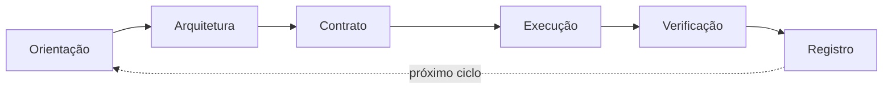

# KOM 2.0 — Ciclo Obrigatório

Sempre que iniciar uma nova tarefa, siga este ciclo de 6 fases:

**Regra fundamental:** Nunca pule fases. Cada fase possui um Gate que deve ser satisfeito antes de avançar.

Consulte `kom/01-orientacao.md` a `kom/07-governanca.md` para o protocolo detalhado de cada fase.
