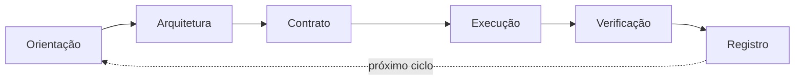

# KOM 2.0 — Ciclo Obrigatório

Sempre que iniciar uma nova tarefa, siga este ciclo de 6 fases:

**Regra fundamental:** Nunca pule fases. Cada fase possui um Gate que deve ser satisfeito antes de avançar.

Consulte `kom/01-orientacao.md` a `kom/07-governanca.md` para o protocolo detalhado de cada fase.

---

### Loop Mode

Para tarefas complexas, o ciclo pode operar em **Loop Mode**:

- **Sub-agent verification:** O verificador da Fase 5 é um sub-agente independente, não o mesmo que executou
- **Ralph technique:** Se o Gate falhar, reinicie a Execução com contexto fresco (mesmo contrato, nova instância)
- **Circuit breakers:** `max_iterations: 5`, `token_budget: 200K/iteração`
- Consulte `kom/08-loop-engineering.md` para o protocolo completo
