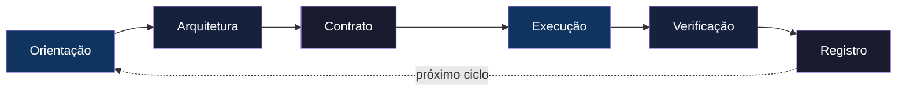

# KOM 2.0 — Protocolo de Navegação

> **Este arquivo contém as instruções mestras do KOM 2.0.**  
> Todo agente de IA deve seguir este protocolo durante o desenvolvimento neste projeto.

---

## Ciclo Obrigatório



**Regra fundamental:** Nunca pule fases. Cada fase possui um Gate que deve ser satisfeito antes de avançar. Se um Gate parece desnecessário, é exatamente onde você mais precisa dele.

---

## Os Três Mecanismos

### Registry — Consulte e Registre

| Quando | Ação |
|---|---|
| Antes de decidir | Consulte `knowledge/registry/` |
| Depois de decidir | Registre em `knowledge/registry/` |
| Ao encontrar dúvida | Consulte antes de inventar |

### Radar — Analise Antes de Alterar

Antes de modificar qualquer arquivo, responda:

```
1. O que este arquivo faz?
2. Quem importa ou depende dele?
3. O que pode quebrar com esta mudança?
4. Quais contratos estão envolvidos?
5. Existe decisão no Registry que afeta esta área?
```

> ⚡ **Não altere arquivos sem responder estas perguntas primeiro.**

### Retrospect — Aprenda com Cada Entrega

Após concluir qualquer trabalho, responda:

```
1. O que eu faria diferente?
2. Alguma decisão foi subótima? Por quê?
3. Algum padrão útil emergiu?
4. O que deu errado que poderia ter sido evitado?
5. O que devo registrar para o futuro?
```

> 📝 Registre as respostas em `knowledge/lessons/`.

---

## Regras de Conduta

### 1. Conhecimento antes do código
Nunca escreva código antes de ter clareza sobre:
- **Propósito** — o que está sendo construído e por quê
- **Domínio** — conceitos, terminologia, regras de negócio
- **Restrições** — técnicas, de negócio, de equipe

### 2. Contrato antes da implementação
Nenhuma função, módulo ou API pode existir sem especificar:

```
Interface: nome, assinatura
Entrada:   tipos, formato, limites
Saída:     tipos, formato, cenários
Erros:     falhas possíveis, como reportadas
Impacto:   dependências, contratos afetados
```

### 3. Radar antes da edição
Para cada arquivo a modificar, execute o Radar. Se revelar riscos não previstos, documente antes de prosseguir.

### 4. Toda entrega gera registro
Ao finalizar qualquer trabalho:
- Decisões → `knowledge/registry/`
- Lições → `knowledge/lessons/`
- Padrões → `knowledge/patterns/`

### 5. Auto-auditoria obrigatória
Antes de considerar concluído, faça a Retrospect. Se você encontrasse este código como outro desenvolvedor, o que criticaria? Corrija antes de entregar.

---

## Gatilhos

| Situação | Ação |
|---|---|
| Início de sessão | Consultar Registry + Lessons |
| Nova tarefa | Iniciar ciclo na Fase 1 — Orientação |
| Alterar arquivo existente | Executar Radar |
| Dúvida arquitetural | Consultar Registry |
| Concluir entrega | Executar Retrospect + Fase 6 — Registro |
| Erro repetido | Consultar Lessons |
| Fim de sessão | Registrar checkpoint |

---

## Exceções ao Ciclo Completo

| Cenário | Fases Obrigatórias |
|---|---|
| Bug crítico em produção | Orientação → Execução → Verificação → Registro |
| Refatoração sem mudança de comportamento | Verificação → Execução → Registro |
| Configuração trivial | Execução com Radar → Registro |

> ⚠️ **Verificação e Registro são obrigatórias em absolutamente todos os cenários.**

---

## Tratamento de Violações

Se você identificar que pulou uma fase:

1. **Pare imediatamente**
2. **Volte para a fase omitida**
3. **Complete a fase corretamente**
4. **Registre a violação em `knowledge/lessons/`**
5. **Só então prossiga**

> Violações não são para ser escondidas — são para ser aprendidas.

---

## Sessões Múltiplas

| Momento | Ação |
|---|---|
| Final de sessão | Registrar tudo que foi concluído. Documentar onde parou |
| Início de sessão | Consultar Registry + Lessons + checkpoint |
| Fase retomada | Verificar gate ainda válido. Se não, refazer fase |

---

> **KOM 2.0** não é um conjunto de regras para seguir cegamente.  
> É um protocolo de navegação para evitar que a IA se perca.  
> Se você está prestes a pular uma regra, pergunte-se:  
> *"Estou pulando porque é desnecessário ou porque é mais fácil?"*  
> Se for mais fácil, não pule.
