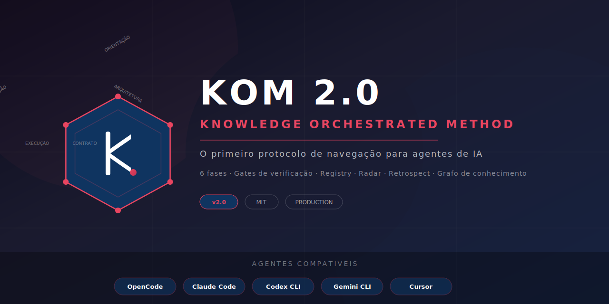
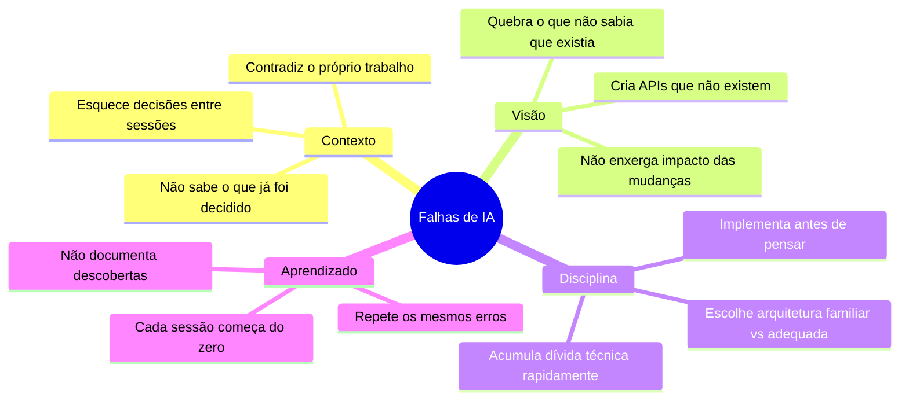
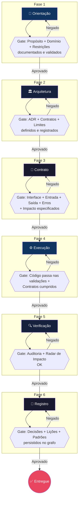
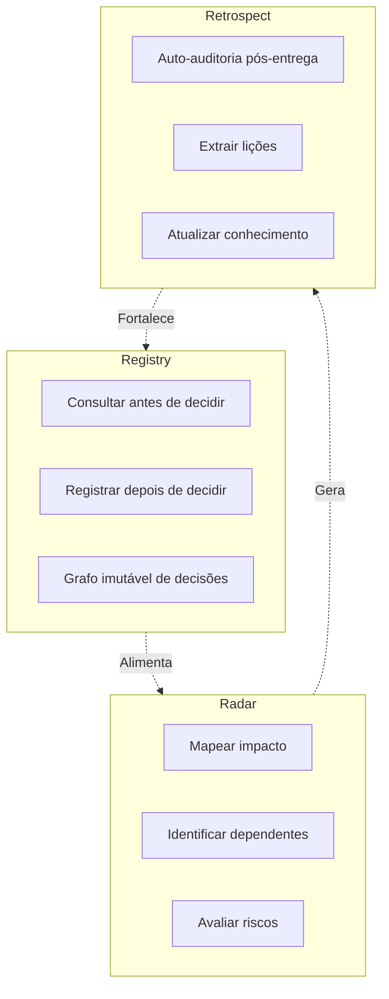
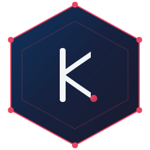

<p align="center">
  
</p>

<br>

<p align="center">
  <a href="#-quick-start"></a>
  <a href="#-o-ciclo"></a>
  <a href="#-como-adotar"></a>
  <a href="#-estrutura"></a>
</p>

---

<br>

> **KOM 2.0** não é um framework. Não é uma biblioteca. Não é um software.
> É um **protocolo de navegação** que qualquer agente de IA pode seguir para desenvolver sistemas complexos sem perder contexto, sem repetir erros e sem acumular dívida técnica.

<br>

---

## ⚡ Quick Start

<table>
<tr>
<td width="33%" align="center">
<br>
<strong>📥 1. Adicione ao projeto</strong><br><br>
<code>git clone https://github.com/CIpriano2025/KOM-2.0.git .</code><br><br>
<em>Copie para a raiz do seu projeto</em>
</td>
<td width="33%" align="center">
<br>
<strong>✅ 2. Verifique a instalação</strong><br><br>
<code>powershell -ExecutionPolicy Bypass -File kom-check.ps1</code><br><br>
<em>14 componentes testados automaticamente</em>
</td>
<td width="33%" align="center">
<br>
<strong>🚀 3. Comece a usar</strong><br><br>
<code>"crie uma API de autenticação seguindo o KOM"</code><br><br>
<em>O agente segue as 6 fases automaticamente</em>
</td>
</tr>
</table>

<p align="center">
  <a href="#-como-adotar"><strong>📖 Guia completo de instalação →</strong></a>
</p>

---

## 🔴 O Problema

Agentes de IA sabem programar. O que eles não sabem é **navegar**.



Nenhuma dessas falhas é culpa do modelo. São falhas de **processo**. O modelo não tem um roteiro. **KOM 2.0 é esse roteiro.**

<p align="center">
  <strong>Transforme desenvolvimento com IA de <em>"prompt + esperança"</em> para <em>"navegue com propósito"</em></strong>
</p>

---

## ⬡ O Ciclo

Seis fases. Cada uma com um **Gate** — uma condição obrigatória que deve ser satisfeita antes de avançar.

### As Seis Fases

| | Fase | Objetivo | Gate | ⏱️ |
|---|---|---|---|---|
| **1** | 🧭 **Orientação** | Entender propósito, domínio e restrições | Propósito + Domínio + Restrições OK | 5–15min |
| **2** | 🏛️ **Arquitetura** | Definir limites, contratos e decisões | ADR + Contratos + Limites OK | 10–30min |
| **3** | 📐 **Contrato** | Especificar interface, entrada, saída e erros | Contrato completo aprovado | 5–20min |
| **4** | ⚙️ **Execução** | Implementar com validação contínua | Código + Testes + Contratos OK | 15–60min |
| **5** | 🔍 **Verificação** | Auditar entrega e mapear impacto | Auditoria + Radar OK | 5–15min |
| **6** | 📝 **Registro** | Persistir decisões, lições e padrões | Registry + Lessons OK | 5–10min |



> 📖 Consulte `kom/01-orientacao.md` a `kom/08-loop-engineering.md` para o protocolo detalhado de cada fase.

---

## 🔧 Os Três Mecanismos

Três mecanismos permanentes operam **durante todo o ciclo**, não apenas em fases específicas.

<br>

<table>
<tr>
<td width="33%" align="center">

### 📚 Registry
**Memória Estrutural**

| Ação | Quando |
|---|---|
| **Consultar** | Antes de decidir |
| **Registrar** | Depois de decidir |
| **Referenciar** | Sempre que afetar |

*Cada entrada: contexto → decisão → alternativas → motivo → consequências*

</td>
<td width="33%" align="center">

### 📡 Radar
**Visão de Impacto**

| Pergunta | Objetivo |
|---|---|
| O que este arquivo **faz**? | Responsabilidade |
| Quem **depende** dele? | Impacto |
| O que pode **quebrar**? | Regressão |
| Quais **contratos**? | Consistência |
| Tem decisão no **Registry**? | Arquitetura |

</td>
<td width="33%" align="center">

### 🔄 Retrospect
**Aprendizado Contínuo**

| Pergunta | Objetivo |
|---|---|
| O que faria **diferente**? | Melhoria |
| Decisão **subótima**? | Corrigir rota |
| Padrão **útil** emergiu? | Capturar |
| O que poderia ter sido **evitado**? | Prevenir |

</td>
</tr>
</table>



---

## 🎯 Para Quem

| Você é... | KOM 2.0 ajuda com... |
|---|---|
| 👨‍💻 **Desenvolvedor solo** usando IA | Nunca mais perder contexto entre sessões |
| 👥 **Time** que usa agentes de IA | Consistência entre membros e decisões rastreáveis |
| 🏢 **Empresa** adotando IA no dev | Governança, rastreabilidade, dívida técnica zero |
| 🔬 **Pesquisador** de agentes | Protocolo formal para experimentos reproduzíveis |

---

## 📥 Como Adotar

<table>
<tr>
<td width="50%" valign="top">

### 🚀 Para OpenCode (nativo)

Já configurado. Skills em `.opencode/skills/` auto-disparem:

| Skill | Dispara em |
|---|---|
| `kom-cycle` | Nova tarefa |
| `kom-radar` | Antes de editar |
| `kom-registry` | Decisão arquitetural |
| `kom-graphify` | Buscar contexto |
| `kom-retrospect` | Após entrega |

### 🔄 Para outros agentes

> 💡 **AGENTS.md** é hoje o padrão universal da indústria (Linux Foundation Agentic AI Foundation, 28+ ferramentas, 60.000+ repositórios).  
> A maioria dos agentes lê `AGENTS.md` nativamente — você só precisa de arquivos extras para recursos específicos de cada ferramenta.

| Agente | Lê AGENTS.md? | Arquivo/config principal |
|---|---|---|
| **OpenCode** | ✅ Nativo | `AGENTS.md` + `.opencode/skills/` |
| **Codex CLI** | ✅ Nativo (criador) | `AGENTS.md` + `.codex/skills/` |
| **Claude Code** | ✅ Nativo (fallback) | `CLAUDE.md` + `.claude/rules/` |
| **Cursor** | ✅ Nativo | `AGENTS.md` + `.cursor/rules/*.mdc` |
| **Windsurf** | ✅ Nativo | `AGENTS.md` + `.windsurf/rules/` |
| **GitHub Copilot** | ✅ Nativo | `AGENTS.md` + `.github/copilot-instructions.md` |
| **Devin** | ✅ Nativo | `AGENTS.md` + `.devin/rules/` |
| **Aider** | ✅ Nativo | `AGENTS.md` + `.aider.rules` |
| **Zed** | ✅ Nativo | `AGENTS.md` + `.zed/rules/` |
| **Jules (JetBrains)** | ✅ Nativo | `AGENTS.md` |
| **VS Code** | ✅ Via extensão | `AGENTS.md` + `.vscode/settings.json` |
| **JetBrains Junie** | ✅ Nativo | `AGENTS.md` |
| **Amp** | ✅ Nativo | `AGENTS.md` + `.amp/rules/` |
| **Continue (IDE)** | ✅ Nativo | `AGENTS.md` + `.continue/settings.json` |
| **Genie** | ✅ Nativo | `AGENTS.md` |
| **Gemini CLI** | ❌ | `GEMINI.md` |
| **Antigravity CLI** | ❌ | `ANTIGRAVITY.md` |

**Setup recomendado para máxima compatibilidade:**

```
projeto/
├── AGENTS.md          ← Lido por Codex CLI, Cursor, Windsurf (e Claude como fallback)
├── CLAUDE.md          ← Apenas se usar Claude Code (skills, hooks, rules)
├── GEMINI.md          ← Apenas se usar Gemini CLI
│
├── .cursor/
│   └── rules/         ← Apenas se usar Cursor (modo granular .mdc)
│
└── .windsurf/
    └── rules/         ← Apenas se usar Windsurf (modo granular)
```

</td>
<td width="50%" valign="top">

### 📊 Verificação automática

Execute o `kom-check.ps1` para validar **14 componentes**:

```
powershell -ExecutionPolicy Bypass -File kom-check.ps1
```

```
+--------------------------------------------------------------------+
|              KOM 2.0 - CHECKLIST DE INSTALACAO                     |
+--------------------------------------------------------------------+
  STATUS: INSTALACAO COMPLETA
  PROGRESSO: [##############################] 100%

  14 de 14 componentes funcionando
  Skills OK | Fases OK | Registry OK | Graphify OK
```

### 🧠 Graphify (opcional, recomendado)

Grafo de conhecimento do codebase para consultas rápidas:

```bash
pip install graphifyy
python -m graphify update .
```

> Sem API key? Modo AST-only funciona sem custo.

</td>
</tr>
</table>

---

## 📁 Estrutura

```
kom-2.0/
├── AGENTS.md                 📋 Instruções mestras
├── README.md                 📖 Esta documentação
├── WELCOME.md                👋 Boas-vindas (1ª sessão)
├── kom-check.ps1             ✅ Verificador de instalação
│
├── assets/                   🎨 Logos e banners
│   ├── logo.svg
│   ├── logo-mark.svg
│   └── banner.svg
│
├── .opencode/
│   └── skills/               ⚡ Auto-ativação
│       ├── kom-cycle/        Nova tarefa
│       ├── kom-radar/        Antes de editar
│       ├── kom-registry/     Decisões
│       ├── kom-graphify/     Grafo
│       ├── kom-retrospect/   Pós-entrega
│       └── kom-loop/         Loop mode
│
├── kom/                      📚 Protocolo detalhado
│   ├── 00-manifesto.md       Filosofia
│   ├── 01-orientacao.md      Fase 1
│   ├── 02-arquitetura.md     Fase 2
│   ├── 03-contrato.md        Fase 3
│   ├── 04-execucao.md        Fase 4
│   ├── 05-verificacao.md     Fase 5
│   ├── 06-registro.md        Fase 6
│   ├── 07-governanca.md      Governança
│   └── 08-loop-engineering.md Loop mode
│
├── knowledge/                🧠 Base de conhecimento
│   ├── registry/             ADRs
│   ├── lessons/              Lições
│   └── patterns/             Padrões
│
└── graphify-out/             🔗 Grafo (Graphify)
```

---

## 🔗 Links

- [📘 Shorthand Guide (X)](https://x.com/affaanmustafa/status/2012378465664745795)
- [📗 Longform Guide (X)](https://x.com/affaanmustafa/status/2014040193557471352)
- [🐛 Reportar bug](https://github.com/CIpriano2025/KOM-2.0/issues)

---

## 📄 Licença

MIT — Livre para usar, modificar e distribuir.

<br>

<p align="center">
  <br><br>
  <strong>KOM 2.0</strong> — A evolução da programação por IA começa aqui.<br>
  <em>2026</em>
</p>
