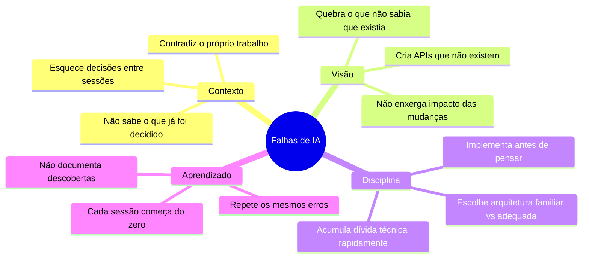
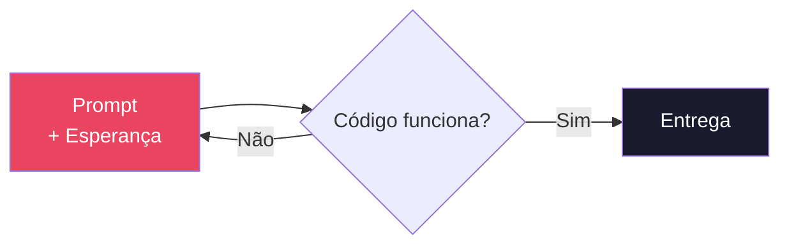
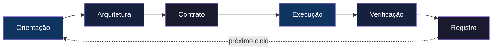
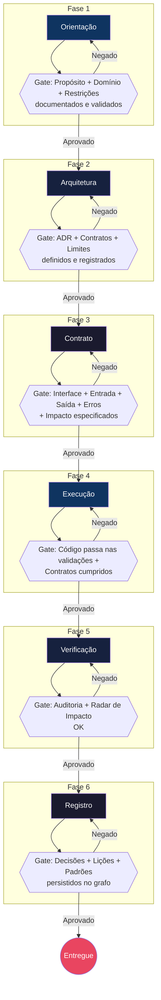
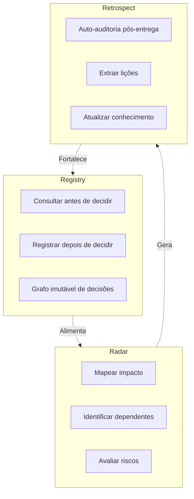

<pre align="center">
╔═══════════════════════════════════╗
║           K O M   2 . 0           ║
║  Knowledge Orchestrated Method.  ║
╚═══════════════════════════════════╝
</pre>

<p align="center"><strong>O primeiro protocolo de navegação para agentes de IA</strong></p>

<p align="center">
  
  
  
  
</p>

<br>

> **KOM 2.0 não é um framework. Não é uma biblioteca. Não é um software.**  
> É um protocolo de navegação que qualquer agente de IA pode seguir para desenvolver sistemas complexos sem perder contexto, sem repetir erros, sem alucinar APIs e sem acumular dívida técnica.

---

## Índice

- [O Problema](#o-problema)
- [A Revolução](#a-revolução)
- [O Ciclo](#o-ciclo)
- [Os Três Mecanismos](#os-três-mecanismos)
- [As Seis Fases](#as-seis-fases)
- [Como Adotar](#como-adotar)
- [Estrutura do Projeto](#estrutura-do-projeto)
- [Licença](#licença)

---

## O Problema

Agentes de IA sabem programar. O que eles não sabem é **navegar**.



Nenhuma dessas falhas é culpa do modelo. São falhas de **processo**. O modelo não tem um roteiro. KOM 2.0 é esse roteiro.

---

## A Revolução

KOM 2.0 transforma desenvolvimento com IA de **"prompt e esperança"** para **"navegue com propósito"**.



**Para:**



---

## O Ciclo

Seis fases. Cada uma com um **Gate** — uma condição obrigatória que deve ser satisfeita antes de avançar.



---

## Os Três Mecanismos

Três mecanismos permanentes operam **durante todo o ciclo**, não apenas em fases específicas.



### Registry — Memória Estrutural

| Ação | Quando |
|---|---|
| **Consultar** o Registry | Antes de qualquer decisão arquitetural |
| **Registrar** no Registry | Depois de qualquer decisão arquitetural |
| **Referenciar** decisões anteriores | Sempre que uma nova decisão as afetar |

Cada entrada no Registry contém: **contexto** → **decisão** → **alternativas** → **motivo** → **consequências**.

### Radar — Visão de Impacto

| Pergunta | Por que |
|---|---|
| O que este arquivo faz? | Entender responsabilidade |
| Quem importa ou depende dele? | Mapear impacto |
| O que pode quebrar? | Prevenir regressão |
| Quais contratos estão envolvidos? | Garantir consistência |
| Existe decisão no Registry? | Honrar arquitetura |

### Retrospect — Aprendizado Contínuo

| Pergunta | Objetivo |
|---|---|
| O que eu faria diferente? | Identificar melhoria |
| Alguma decisão foi subótima? | Corrigir rota |
| Algum padrão útil emergiu? | Capturar conhecimento |
| O que deu errado e poderia ter sido evitado? | Prevenir recorrência |

---

## As Seis Fases

| Fase | Objetivo | Gate | Tempo Estimado |
|---|---|---|---|
| **1. Orientação** | Entender propósito, domínio, restrições | Propósito + Domínio + Restrições OK | 5-15 min |
| **2. Arquitetura** | Definir limites, contratos, decisões | ADR + Contratos + Limites OK | 10-30 min |
| **3. Contrato** | Especificar interface, entrada, saída, erros | Contrato completo aprovado | 5-20 min |
| **4. Execução** | Implementar com validação contínua | Código + Testes + Contratos OK | 15-60 min |
| **5. Verificação** | Auditar entrega, mapear impacto | Auditoria + Radar OK | 5-15 min |
| **6. Registro** | Persistir decisões, lições, padrões | Registry + Lessons OK | 5-10 min |

> 📖 Consulte `kom/01-orientacao.md` a `kom/07-governanca.md` para o protocolo detalhado de cada fase.

---

## Como Adotar

### 1. Adicione ao seu projeto

```
Copie a pasta inteira do KOM 2.0 para a raiz do seu projeto
```

Seu `AGENTS.md` será lido automaticamente pelo agente ao iniciar sessão.

### 2. 🚀 Auto-ativação (OpenCode)

KOM 2.0 inclui skills OpenCode em `.opencode/skills/` que **auto-disparam** nos momentos certos:

| Skill | Dispara quando |
|---|---|
| `kom-cycle` | Nova tarefa, feature, projeto |
| `kom-radar` | Antes de editar qualquer arquivo |
| `kom-registry` | Decisão arquitetural necessária |
| `kom-retrospect` | Após concluir uma entrega |

**Sem instalação extra.** O OpenCode descobre e ativa estas skills automaticamente.

### 3. Consulte as referências

O diretório `kom/` contém o protocolo detalhado de cada fase com:
- Protocolo passo a passo
- Gate de saída com checklist
- Anti-padrões documentados
- Radar Check integrado

### 4. Use o sistema de memória

| Diretório | Função | Criado por |
|---|---|---|
| `knowledge/registry/` | Decisões arquiteturais | Agente |
| `knowledge/lessons/` | Lições aprendidas | Agente |
| `knowledge/patterns/` | Padrões identificados | Agente |

### 5. Configure o Graphify (opcional, recomendado)

Graphify constrói um grafo de conhecimento do seu codebase para consultas rápidas.

```bash
# Instalar
pip install graphifyy

# Configurar sua API key (uma das opções abaixo)
export GEMINI_API_KEY="sua-chave-aqui"      # Gemini (gratuito)
export OPENAI_API_KEY="sua-chave-aqui"      # OpenAI
export ANTHROPIC_API_KEY="sua-chave-aqui"   # Claude

# Buildar o grafo
graphify .

# Após mudanças no código (AST-only, sem custo):
graphify update .
```

**API keys gratuitas:**
- **Gemini:** https://aistudio.google.com/apikey (sem cartão de crédito)
- **DeepSeek:** alternativa econômica

Sem API key, o `graphify update .` funciona para arquivos de código (AST-only, zero custo).

### 6. Adapte a outros agentes

| Agente | Como usar |
|---|---|
| **OpenCode** | Já configurado (skills + AGENTS.md) |
| **Claude Code** | Renomear `AGENTS.md` → `CLAUDE.md` |
| **Codex CLI** | `AGENTS.md` (já funciona) |
| **Gemini CLI** | Renomear `AGENTS.md` → `GEMINI.md` |
| **Cursor** | Copiar `.opencode/skills/` → `.cursor/rules/` |
| **Windsurf** | Copiar `.opencode/skills/` → `.windsurf/rules/` |

---

## Estrutura do Projeto

```
├── AGENTS.md                  Instruções mestras do KOM 2.0
├── README.md                  Esta visão geral
│
├── .opencode/
│   └── skills/                Skills OpenCode (auto-ativação)
│       ├── kom-cycle/         Dispara em novas tarefas
│       ├── kom-radar/         Dispara antes de editar
│       ├── kom-registry/      Dispara em decisões
│       ├── kom-retrospect/    Dispara após entregas
│       └── kom-loop/          Controles de loop mode
│
├── kom/                       Protocolo detalhado
│   ├── 00-manifesto.md        Filosofia e princípios
│   ├── 01-orientacao.md       Fase 1 — Orientação
│   ├── 02-arquitetura.md      Fase 2 — Arquitetura
│   ├── 03-contrato.md         Fase 3 — Contrato
│   ├── 04-execucao.md         Fase 4 — Execução
│   ├── 05-verificacao.md      Fase 5 — Verificação
│   ├── 06-registro.md         Fase 6 — Registro
│   ├── 07-governanca.md       Auto-governança entre fases
│   └── 08-loop-engineering.md Loop Engineering (ReAct, Ralph, sub-agents)
│
├── knowledge/                 Base de conhecimento do projeto
│   ├── registry/              Decisões arquiteturais (ADR + MADR template)
│   ├── lessons/               Lições aprendidas (evolutivo)
│   └── patterns/              Padrões identificados (consultivo)
│
├── graphify-out/              Grafo de conhecimento (Graphify)
│   ├── graph.json             Grafo queryável
│   ├── GRAPH_REPORT.md        Relatório de comunidades e god nodes
│   └── graph.html             Visualização interativa
│
└── Projeto Kom 2.0/           Saída dos projetos desenvolvidos com KOM 2.0
```

---

## Licença

MIT — Livre para usar, modificar e distribuir.

<br>

<p align="center">
  <strong>KOM 2.0</strong> — A evolução da programação por IA começa aqui.<br>
  <em>2026</em>
</p>
