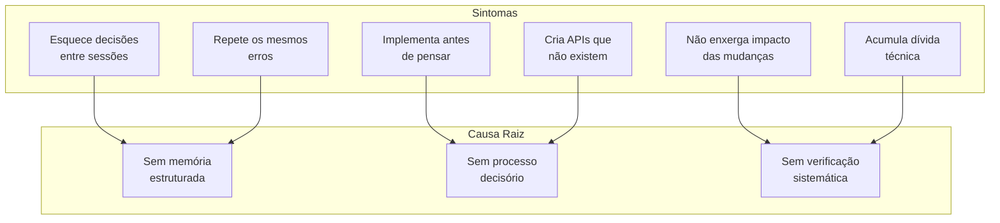
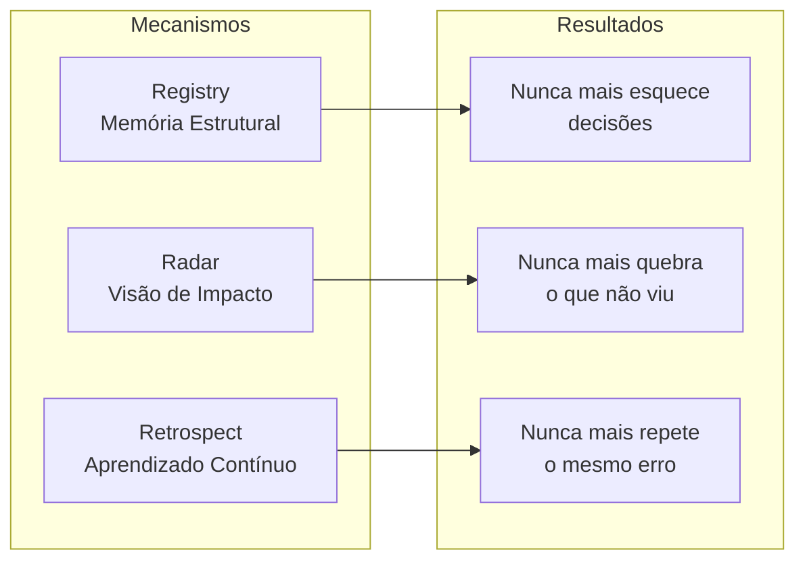

# KOM 2.0 — Manifesto

> **A primeira metodologia projetada desde o início para agentes de IA.**

---

## Propósito

Agentes de IA modernos sabem programar. O problema não é capacidade técnica — é **navegação**. Eles operam sem memória do que decidiram ontem, sem visão do que uma mudança vai quebrar hoje e sem mecanismo para aprender com os erros de amanhã.

KOM 2.0 existe para resolver isso. É um **protocolo de navegação** que qualquer agente pode seguir, em qualquer ferramenta, em qualquer linguagem, em qualquer projeto.

---

## Os Seis Problemas

---

## A Solução

---

## Princípios

### 1. Conhecimento primeiro
Nunca codifique antes de entender. Nunca entenda antes de perguntar.

### 2. Gates são barreiras, não sugestões
Se o gate não passou, a fase não acabou. Não existe "quase passou".

### 3. Registry é imutável
Decisões registradas não são apagadas. São corrigidas com novas decisões que referenciam as anteriores.

### 4. Radar antes do remo
Antes de qualquer alteração, mapeie impacto. Mesmo que pareça óbvio.

### 5. Retrospect não é opcional
Toda entrega gera lições. Se não gerou, não foi entrega.

### 6. Simplicidade sobre completude
Prefira 3 regras que funcionam a 10 regras que ninguém segue.

---

## Público

KOM 2.0 funciona com qualquer agente que leia instruções em markdown:

- OpenCode
- Claude Code
- Codex CLI
- Gemini CLI
- Cursor
- Windsurf
- Cline
- Roo Code

---

## O Que KOM 2.0 NÃO É

| Não é | É |
|---|---|
| Framework de software | Protocolo de navegação |
| Conjunto de prompts | Metodologia estruturada |
| Concorrente de ferramentas | Camada que funciona dentro delas |
| Camada de abstração | Organizador de complexidade |

---

> *"O problema não é que as IAs programam mal.  
> O problema é que elas tomam decisões de arquitetura cedo demais,  
> perdem contexto e não possuem um mecanismo de autocorreção contínua."*
