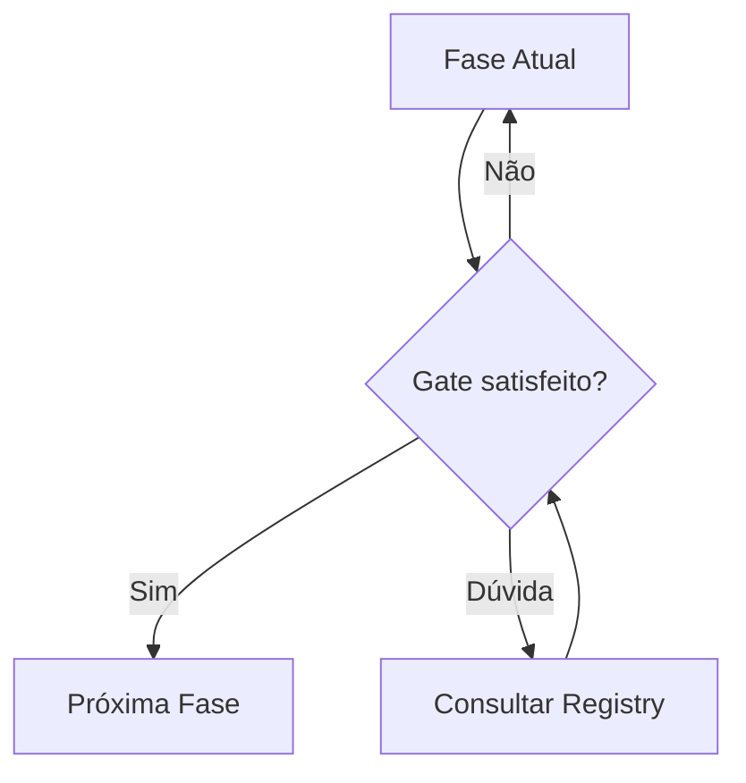
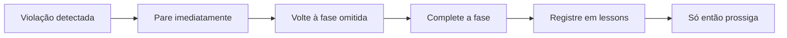

# Governança — Auto-Governança Entre Fases

> **O ciclo serve ao projeto. A governança garante que o ciclo seja respeitado.**

---

## Propósito

Governança é o sistema que garante que os gates sejam respeitados, o Radar seja acionado e a Retrospectiva aconteça. Opera **durante** todo o ciclo.

---

## Transições Entre Fases

Se o gate não passou, **não avance**. Não existe "quase passou".

---

## Exceções ao Ciclo Completo

| Situação | Fases Obrigatórias |
|---|---|
| Bug crítico em produção | Orientação → Execução → Verificação → Registro |
| Refatoração sem mudança de comportamento | Verificação → Execução → Registro |
| Configuração trivial | Execução com Radar → Registro |
| Documentação | Execução → Verificação |

> ⚠️ **Verificação e Registro são obrigatórias em absolutamente todos os cenários.**

---

## Tratamento de Violações

Violações não são para ser escondidas — são para ser aprendidas.

---

## Sessões Múltiplas

| Momento | Ação |
|---|---|
| **Final de sessão** | Registrar tudo concluído. Checkpoint em `knowledge/session-checkpoint.md` |
| **Início de sessão** | Consultar Registry + Lessons + checkpoint |
| **Fase retomada** | Verificar se gate ainda é válido. Se não, refazer fase |

> Para checkpoints, documente: fase atual, gate atual, próximos passos, decisões pendentes.

---

## Gatilhos Rápidos

| Situação | Ação |
|---|---|
| Início de ciclo | Fase 1 — Orientação |
| Dúvida sobre decisão | Consultar Registry |
| Antes de editar arquivo | Executar Radar |
| Após implementar | Executar Verificação + Registro |
| Fim de sessão | Checkpoint |
| Início de nova sessão | Registry + Lessons + checkpoint |
| Erro repetido | Consultar Lessons para solução |
| Violação detectada | Parar → Voltar → Completar → Registrar |

---

## Princípios da Governança

1. **Gates não são negociáveis.** Se o critério não foi satisfeito, a fase não acabou.
2. **Transparência sobre perfeição.** Erros acontecem. Registrá-los é mais importante que evitá-los.
3. **Consistência sobre velocidade.** Pular etapas acelera o curto prazo e destrói o longo prazo.
4. **O ciclo serve ao projeto, não o contrário.** Exceções existem para casos reais, não para preguiça.
5. **Dúvida não é falha.** É oportunidade de aprender. Registre antes de perguntar.

---

> *"Um bom processo não impede erros.  
> Um bom processo impede que os erros passem despercebidos."*
